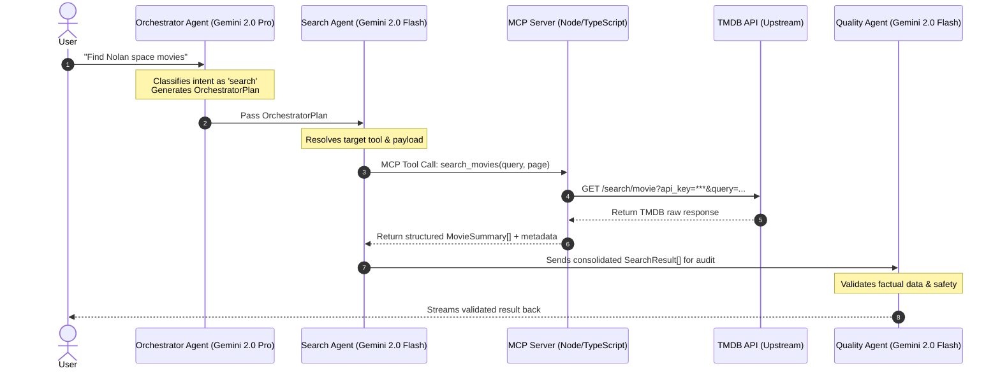

# Model Context Protocol (MCP) Interface Specification

This document defines the interface, protocol structure, transport schemas, and tools exposed by the **Movie Explorer MCP Server**. The MCP Server acts as an abstraction layer between the multi-agent system (specifically the **Search Agent**) and the upstream **TMDB (The Movie Database) API**.

---

## 1. System Architecture Flow

The following Mermaid diagram outlines the flow of a query through the multi-agent pipeline and how the MCP server interacts with the upstream services:



---

## 2. Server Configuration & Transport Protocols

The MCP Server is implemented as a standalone Node.js package under the `mcp-server/` directory.

### Transport Modes
The server supports two transport mechanisms depending on the environment:
- **Development (`StdioServerTransport`):** Standard input/output stream communication. Perfect for local CLI testing and agent execution.
- **Production (`SSEServerTransport`):** Server-Sent Events (SSE) for web-native, multi-tenant agent execution.

### Environment Requirements
The MCP server requires the following server-side environment variable to be set:
- `TMDB_API_KEY`: A valid v3 read key for the TMDB API.

---

## 3. Tool Definitions & Schemas

The server registers and exposes **5 core tools** to the client. All tools validate inputs using `zod` and return structured JSON responses.

| Tool Name | Description | Key Input Parameters | Upstream TMDB Route |
| :--- | :--- | :--- | :--- |
| `search_movies` | Search for movies by title or query string. | `query` *(required)*, `page` *(optional)* | `GET /search/movie` |
| `get_movie_details` | Retrieve full details for a specific movie. | `movieId` *(required)* | `GET /movie/{id}` |
| `get_recommendations` | Get recommended movies based on a source movie. | `movieId` *(required)* | `GET /movie/{id}/recommendations` |
| `get_trending` | Retrieve list of currently trending movies. | `window` *(optional)* | `GET /trending/movie/{window}` |
| `get_credits` | Get top cast members and director for a movie. | `movieId` *(required)* | `GET /movie/{id}/credits` |

---

### 3.1 `search_movies`
Search for movies by text matching title, overview, or keywords.

* **Input Schema (Zod):**
  ```typescript
  const SearchMoviesSchema = z.object({
    query: z.string().min(1).describe("The search query string (e.g. 'Interstellar')"),
    page: z.number().optional().default(1).describe("The page number of results to fetch")
  });
  ```

* **Request Example:**
  ```json
  {
    "name": "search_movies",
    "arguments": {
      "query": "Interstellar",
      "page": 1
    }
  }
  ```

* **Response Schema:**
  ```json
  {
    "results": [
      {
        "id": 157336,
        "title": "Interstellar",
        "overview": "The adventures of a group of explorers who make use of a newly discovered wormhole...",
        "release_date": "2014-11-05",
        "poster_path": "/gEU2QvEw6fg7vR365zJzQn6U237.jpg",
        "vote_average": 8.4,
        "genre_ids": [12, 18, 878]
      }
    ],
    "total_pages": 15
  }
  ```

---

### 3.2 `get_movie_details`
Retrieve comprehensive details of a movie by its TMDB ID.

* **Input Schema (Zod):**
  ```typescript
  const GetMovieDetailsSchema = z.object({
    movieId: z.string().describe("The TMDB Movie ID (e.g. '157336')")
  });
  ```

* **Request Example:**
  ```json
  {
    "name": "get_movie_details",
    "arguments": {
      "movieId": "157336"
    }
  }
  ```

* **Response Schema:**
  Returns the complete TMDB movie detail object, including structural keys:
  ```json
  {
    "id": 157336,
    "title": "Interstellar",
    "tagline": "Mankind was born on Earth. It was never meant to die here.",
    "overview": "The adventures of a group of explorers who make use of a newly discovered wormhole...",
    "runtime": 169,
    "budget": 165000000,
    "revenue": 701729206,
    "genres": [
      { "id": 12, "name": "Adventure" },
      { "id": 18, "name": "Drama" },
      { "id": 878, "name": "Science Fiction" }
    ],
    "release_date": "2014-11-05",
    "vote_average": 8.4,
    "poster_path": "/gEU2QvEw6fg7vR365zJzQn6U237.jpg",
    "backdrop_path": "/xJHokn75j41mBv6ePz462R4Z5SK.jpg"
  }
  ```

---

### 3.3 `get_recommendations`
Fetch recommended or similar movies for a given movie ID.

* **Input Schema (Zod):**
  ```typescript
  const GetRecommendationsSchema = z.object({
    movieId: z.string().describe("The TMDB Movie ID to get recommendations for")
  });
  ```

* **Request Example:**
  ```json
  {
    "name": "get_recommendations",
    "arguments": {
      "movieId": "157336"
    }
  }
  ```

* **Response Schema:**
  ```json
  {
    "results": [
      {
        "id": 27205,
        "title": "Inception",
        "overview": "Cobb, a skilled thief who commits corporate espionage by infiltrating...",
        "release_date": "2010-07-15",
        "poster_path": "/o0O4Qq7w7tUzJ25q6Z698raQe7G.jpg",
        "vote_average": 8.4
      }
    ]
  }
  ```

---

### 3.4 `get_trending`
Get trending movies over a specified time window.

* **Input Schema (Zod):**
  ```typescript
  const GetTrendingSchema = z.object({
    window: z.enum(["day", "week"]).optional().default("day").describe("The trending window timeframe")
  });
  ```

* **Request Example:**
  ```json
  {
    "name": "get_trending",
    "arguments": {
      "window": "week"
    }
  }
  ```

* **Response Schema:**
  ```json
  {
    "results": [
      {
        "id": 823464,
        "title": "Godzilla x Kong: The New Empire",
        "overview": "Following their explosive showdown, Godzilla and Kong must reunite...",
        "release_date": "2024-03-27",
        "poster_path": "/v4yvgyu4964j2fL0d25nQvL01c.jpg",
        "vote_average": 7.2
      }
    ]
  }
  ```

---

### 3.5 `get_credits`
Get members of the cast and key crew members (specifically the Director).

* **Input Schema (Zod):**
  ```typescript
  const GetCreditsSchema = z.object({
    movieId: z.string().describe("The TMDB Movie ID to fetch credits for")
  });
  ```

* **Request Example:**
  ```json
  {
    "name": "get_credits",
    "arguments": {
      "movieId": "157336"
    }
  }
  ```

* **Response Schema:**
  ```json
  {
    "id": 157336,
    "cast": [
      {
        "id": 10297,
        "name": "Matthew McConaughey",
        "character": "Cooper",
        "profile_path": "/eU1mGpaGV6eSxhX59BTKo3T0kt1.jpg",
        "order": 0
      },
      {
        "id": 1813,
        "name": "Anne Hathaway",
        "character": "Brand",
        "profile_path": "/6X1wWvG1g017qS63223t1g6Nq1V.jpg",
        "order": 1
      }
    ],
    "director": {
      "id": 525,
      "name": "Christopher Nolan",
      "profile_path": "/rrTx0B2qjPq5G598Xq8R35yX598.jpg"
    }
  }
  ```

---

## 4. Error Handling and Resiliency

The MCP server guarantees uniform error envelopes in compliance with the Model Context Protocol specifications:

1. **TMDB Outages or Key Errors:**
   If the upstream API returns an HTTP error status (e.g., 401 Unauthorized or 404 Not Found), the server wraps it inside a client-safe error code:
   ```json
   {
     "isError": true,
     "error": {
       "code": -32000,
       "message": "TMDB API Error: [401] Invalid API Key"
     }
   }
   ```
2. **Schema Validation Errors:**
   If the search agent triggers a tool with malformed parameters, Zod validation fails, generating an error envelope without making upstream network calls:
   ```json
   {
     "isError": true,
     "error": {
       "code": -32602,
       "message": "Invalid params: query is required"
     }
   }
   ```
