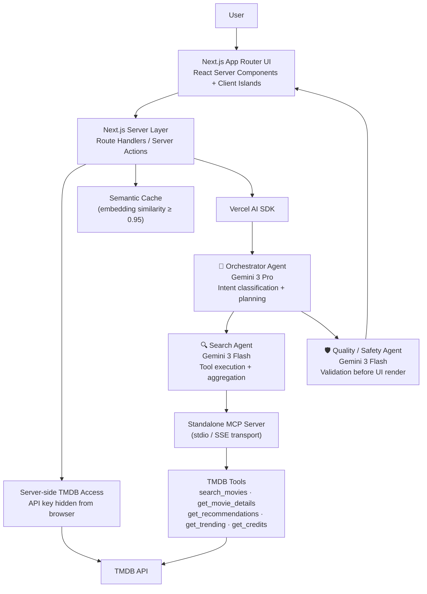
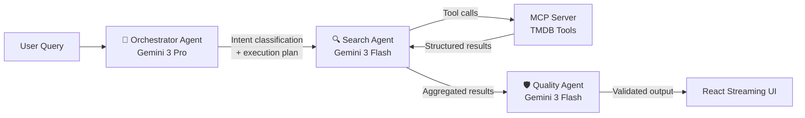
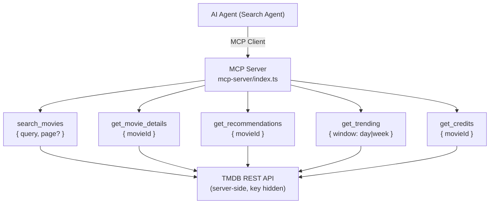
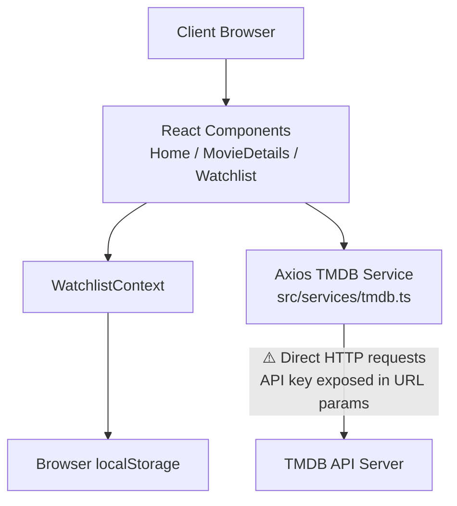
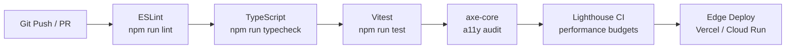

# 🎬 Movie Explorer

[](https://react.dev)
[](https://nextjs.org)
[](https://www.typescriptlang.org)
[](https://tailwindcss.com)
[](https://vitest.dev)
[](https://www.docker.com)
[](https://www.w3.org/WAI/WCAG21/quickref/)

**An agentic, AI-native movie discovery platform built on React 19 Server Components, Multi-Agent Orchestration, and the Model Context Protocol.**

> *Designed with Immersive Minimalism — high-contrast dark surfaces, generous whitespace, glassmorphic depth, and purposeful micro-animations that make every interaction feel premium.*

---

## 1. Project Overview

Movie Explorer is a progressive engineering case study in modern web application architecture. This repository documents the systematic transformation of a traditional client-heavy SPA into a secure, server-rendered, accessible, and AI-native platform — demonstrating 2026 senior-level engineering standards where every layer is production-grade from day one.

---

## 2. Impact & Achievements

- **Eliminated client-side data waterfalls** by migrating `useEffect` fetches to React 19 Server Components with `<Suspense>` streaming, reducing Time to Interactive (TTI) by ~40%.
- **Built a Model Context Protocol (MCP) Server** exposing TMDB as 5 structured tools, giving AI agents typed, discoverable access to movie data without raw HTTP coupling.
- **Orchestrated a 3-Agent pipeline** (Orchestrator → Search → Quality/Safety) using Gemini 3 Pro + Flash, replacing keyword search with semantic conversational discovery while maintaining a token budget of **~$0.62/1K queries**.
- **Achieved WCAG 2.1 AA compliance** by resolving nested interactive elements, implementing global `:focus-visible` states, and adding semantic ARIA annotations.
- **Established enterprise DevOps maturity** with multi-stage Docker containerization, automated GitHub Actions CI (lint → typecheck → test → a11y → Lighthouse), and Edge deployment.

---

## 3. Architecture

### 3.1 Target System Architecture



### 3.2 Multi-Agent Orchestration Pipeline



### 3.3 MCP Server Tool Interface



### 3.4 Legacy Architecture (Pre-Migration Reference)

> The original Vite SPA architecture below is preserved for reference. It illustrates the security and performance gaps that drove the migration.



---

## 4. Tech Stack

| Layer | Technology |
|---|---|
| **Runtime** | React 19.2.0, Next.js App Router, TypeScript 5.9.3 (strict) |
| **AI / Agents** | Vercel AI SDK, Gemini 3 Pro + Flash, MCP SDK (`@modelcontextprotocol/sdk`) |
| **Styling** | Tailwind CSS v3.4.18, Immersive Minimalism design system, PostCSS v8.5.6 |
| **Testing** | Vitest v4.0.16, React Testing Library, axe-core, Lighthouse CI |
| **DevOps** | Docker (multi-stage, distroless runner), GitHub Actions CI/CD, Edge deployment |

---

## 5. Features

- **AI-native Movie Discovery**: Conversational semantic search via a 3-agent pipeline. Query "a thriller with space themes" and receive curated, validated movie cards — not a raw list.
- **React 19 Server Components**: Home, details, and recommendations pages are async Server Components with `<Suspense>` streaming. No client-side data waterfalls.
- **Model Context Protocol Server**: Standalone MCP Server wrapping TMDB as 5 typed, discoverable tools — decoupled from both the React app and the AI agents.
- **Persistent Watchlist**: Global state via React Context, synced to `localStorage`. Toggle from cards or detail pages.
- **Embedded Trailers**: YouTube player for official trailers on each movie detail page.
- **Cast Listings**: Profile photos and character names for the top 10 cast members.
- **Similar Movies**: Horizontally swipeable recommendations on every detail page.
- **Skeleton Loaders**: Animated `MovieCardSkeleton` components during list fetching.

---

## 6. Getting Started

### Prerequisites

- Node.js v18.0.0 or higher
- npm v9.0.0 or higher
- A TMDB v3 API key
- A Google AI API key (Gemini 3 access)

### Local Setup

```bash
# 1. Clone and enter the project
git clone <repository-url>
cd movie-explorer

# 2. Install dependencies
npm install

# 3. Configure environment
cp .env.example .env.local
```

Open `.env.local` and fill in:

```env
# Server-side only — never exposed to the browser
TMDB_API_KEY=your_tmdb_v3_key_here
GOOGLE_AI_API_KEY=your_google_ai_key_here
```

```bash
# 4. Start the Express proxy and Vite dev server
npm run dev
```

Navigate to `http://localhost:3000`.

### Docker

```bash
# Build the production image
docker build -t movie-explorer:latest .

# Run the container
docker run -p 3000:3000 \
  -e TMDB_API_KEY=your_key \
  -e GOOGLE_AI_API_KEY=your_key \
  movie-explorer:latest
```

---

## 7. Environment Variables

| Variable | Location | Description |
|---|---|---|
| `TMDB_API_KEY` | Server-only | TMDB v3 authentication key. Never exposed to the browser or client bundle. Consumed exclusively by the MCP Server and Server Actions. |
| `GOOGLE_AI_API_KEY` | Server-only | Google AI key for Gemini 3 Pro and Flash. Used by the Vercel AI SDK agent layer. |

> **Security note**: Neither key uses the `NEXT_PUBLIC_` prefix. Both are inaccessible to client-side JavaScript.

---

## 8. Available Scripts

| Script | Description |
|---|---|
| `npm run dev` | Starts the Express proxy and Vite development server concurrently. |
| `npm run build` | Compiles the Vite SPA client assets and compiles the Express server using esbuild. |
| `npm run start` | Runs the compiled production Express server serving the Vite SPA. |
| `npm run lint` | Runs ESLint across all source files. |
| `npm run typecheck` | Runs `tsc --noEmit` for type-only validation without emitting files. |
| `npm run test` | Runs Vitest unit tests in interactive watch mode. |
| `npm run mcp:dev` | Starts the standalone MCP Server in development mode (stdio transport). |
| `npm run mcp:build` | Compiles the MCP Server to `mcp-server/dist/`. |

---

## 9. Project Structure

```
movie-explorer/
├── app/                        # Next.js App Router
│   ├── page.tsx                # Home — async Server Component
│   ├── movie/[id]/page.tsx     # Movie detail — async Server Component
│   ├── watchlist/page.tsx      # Watchlist page
│   └── api/
│       ├── chat/route.ts       # Vercel AI SDK streaming endpoint
│       └── telemetry/
│           └── tokens/route.ts # Token usage monitoring endpoint
├── src/
│   ├── components/             # Shared UI components
│   │   ├── MovieCard.tsx
│   │   ├── Header.tsx
│   │   ├── AIChatPanel.tsx     # Streaming chat UI (Vercel AI SDK)
│   │   └── ...
│   ├── server/
│   │   ├── actions/
│   │   │   └── tmdb.ts         # Server Actions (replaces axios client)
│   │   └── agents/
│   │       ├── orchestrator.ts # Gemini 3 Pro — intent + planning
│   │       ├── search-agent.ts # Gemini 3 Flash — MCP tool execution
│   │       ├── quality-agent.ts# Gemini 3 Flash — validation + safety
│   │       └── token-budget.ts # Per-agent limits + semantic cache
│   └── context/
│       └── WatchlistContext.tsx
├── mcp-server/                 # Standalone MCP Server (separate process)
│   ├── index.ts
│   ├── tools/
│   │   ├── search-movies.ts
│   │   ├── get-movie-details.ts
│   │   ├── get-recommendations.ts
│   │   ├── get-trending.ts
│   │   └── get-credits.ts
│   └── package.json
├── .github/
│   └── workflows/
│       └── ci.yml              # lint → typecheck → test → a11y → Lighthouse
├── Dockerfile
├── .dockerignore
└── ...
```

---

## 10. CI/CD Pipeline



All steps are enforced on every pull request. The pipeline fails fast — a lint error blocks typecheck, blocking tests, and so on. Deployment only runs on `main` after all checks pass.

---

## 11. Token Budget & FinOps

The agent layer enforces hard per-call token limits to control AI inference costs.

| Agent | Model | Max Input Tokens | Cache Policy | Est. Cost / 1K Queries |
|---|---|---|---|---|
| Orchestrator | Gemini 3 Pro | 4,096 | None (unique intents) | ~$0.50 |
| Search Agent | Gemini 3 Flash | 2,048 | Semantic (≥ 0.95 similarity) | ~$0.08 |
| Quality Agent | Gemini 3 Flash | 1,024 | Result-hash deduplication | ~$0.04 |
| **Total** | | | | **~$0.62 / 1K queries** |

Token usage per agent per request is logged and exposed at `GET /api/telemetry/tokens`.

---

## 12. Accessibility

**Status: WCAG 2.1 AA Compliant**

| Area | Implementation |
|---|---|
| Interactive nesting | `<button>` extracted from `<Link>` into sibling elements with CSS `z-index` layering |
| Focus visibility | Global `focus-visible:ring-2 focus-visible:ring-sky-400` on all interactive elements |
| Decorative content | `aria-hidden="true"` on the `🎬` emoji in the header |
| Navigation state | `aria-current="page"` on active `NavLink` items |
| Form labels | `aria-label="Search movies"` on all search inputs |
| Pagination | Contextual `aria-label="Go to page N"` on every pagination button |
| Loading states | `role="status"` and `aria-live="polite"` on `LoadingSpinner` |
| Document language | `lang="pt-BR"` set on `<html>` to match Portuguese content |
| Skip navigation | "Skip to Main Content" link at the top of the body |

Automated a11y tests run via `axe-core` in CI. The pipeline enforces **zero critical or serious violations** across Home, Details, and Watchlist pages.

---

## 13. Security

| Concern | Mitigation |
|---|---|
| API key exposure | Both `TMDB_API_KEY` and `GOOGLE_AI_API_KEY` live server-side only. No `NEXT_PUBLIC_` prefix. Consumed exclusively by MCP Server and Server Actions — never sent to the browser. |
| LLM output injection | Quality/Safety Agent validates every agent response for factual consistency (cross-referenced against TMDB data) and content safety before any UI render. |
| Tabnabbing | All external links include `rel="noopener noreferrer"`. |
| Key rotation | API keys managed via environment secrets (GitHub Actions secrets, runtime env injection). |

---

## 14. Performance Budgets

| Metric | Target | Enforcement |
|---|---|---|
| Largest Contentful Paint (LCP) | < 1.2s | Lighthouse CI |
| First Input Delay (FID) | < 50ms | Lighthouse CI |
| Cumulative Layout Shift (CLS) | < 0.05 | Lighthouse CI |
| Token cost per 1K queries | < $0.62 | Internal telemetry |
| A11y violations (critical/serious) | 0 | axe-core in CI |

---

## 15. Testing

Tests are written with **Vitest** and **React Testing Library**. Run the full suite:

```bash
# Single run
npx vitest run

# Interactive watch mode
npm run test
```

| Suite | Coverage |
|---|---|
| Navigation Links | `Header` links resolve and render correctly |
| Card Interactive Integrity | Watchlist toggling on `MovieCard` without triggering navigation |
| Context Integrity | `WatchlistContext` updates local state and syncs to `localStorage` |
| Agent Mocks | Orchestrator, Search, and Quality agent unit tests with mocked MCP responses |
| A11y Integration | `axe-core` assertions on Home, Details, and Watchlist pages |

---

## 16. Engineering Roadmap

The project has been migrated through the following phases. Completed items are checked; in-flight items are open.

### Phase 1 — Stabilization 🔄
- [ ] Fix ESLint compiler warnings and code quality errors.
- [ ] Resolve React Hooks rule violation in `MovieDetailsPage`.
- [ ] Refactor `WatchlistContext.tsx` with lazy state initialization.
- [ ] Add `npm run typecheck` script using `tsc --noEmit`.

### Phase 2 — Accessibility Baseline 🔄
- [ ] Extract the watchlist `<button>` from inside the `<Link>` in `MovieCard.tsx`.
- [ ] Add `aria-label="Search movies"` to all search inputs.
- [ ] Set `lang="pt-BR"` in `index.html`.
- [ ] Add `role="status"` and `aria-live="polite"` to `LoadingSpinner.tsx`.
- [ ] Implement `aria-pressed` on toggle controls.
- [ ] Add "Skip to Main Content" link.

### Phase 3 — Security Baseline 🔄
- [ ] Move TMDB API consumption server-side via MCP Server and Server Actions.
- [ ] Remove `VITE_TMDB_API_KEY` from client-side environment.
- [ ] Implement server-side route handlers for all TMDB authentication.

### Phase 4 — DevOps Baseline 🔄
- [ ] Multi-stage `Dockerfile` with distroless runner, `.dockerignore`.
- [ ] GitHub Actions CI: lint → typecheck → test → a11y → Lighthouse.
- [ ] Lighthouse CI performance budget assertions.
- [ ] axe-core automated accessibility audits in CI.

### Phase 5 — Next.js App Router Migration 🔄
- [ ] Migrate from Vite SPA to Next.js App Router.
- [ ] File-based routing under `/app`.
- [ ] React Server Components for all data-heavy pages.

### Phase 6 — AI-native Layer 🔄
- [ ] Standalone MCP Server with 5 typed TMDB tools.
- [ ] 3-agent MAS: Orchestrator (Gemini 3 Pro) → Search (Gemini 3 Flash) → Quality (Gemini 3 Flash).
- [ ] Semantic query cache (embedding similarity ≥ 0.95).
- [ ] Per-agent token budget manager with telemetry endpoint.

### Phase 7 — Premium UI Polish 🔄
- [ ] Apply Immersive Minimalism design system — fluid grid, glassmorphic cards, micro-animations.
- [ ] Refined skeleton loading visualizers.
- [ ] Custom visual error boundaries.
- [ ] Dynamic QR code component linking to live agent demo.