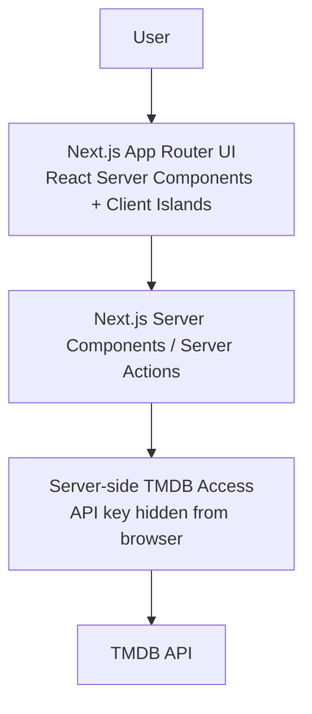
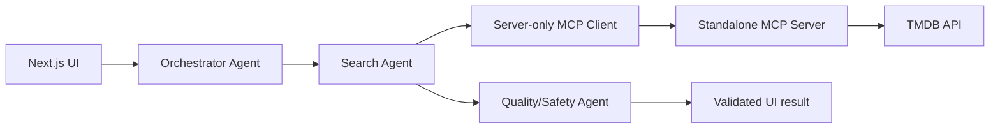
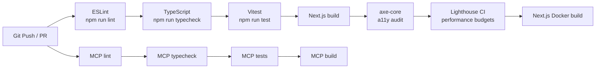

# 🎬 Movie Explorer

[](https://react.dev)
[](https://nextjs.org)
[](https://www.typescriptlang.org)
[](https://tailwindcss.com)
[](https://vitest.dev)
[](https://www.docker.com)
[](https://www.w3.org/WAI/WCAG21/quickref/)

**A movie discovery platform built on React 19, Next.js App Router Server Components, and Server Actions.**

> **Current checkpoint: Phase 6.3 implemented.** The standalone MCP server, five TMDB tools, and server-only client adapter are available. AI agents and conversational streaming are not implemented yet; premium UI polish remains Phase 7 work.

---

## 1. Project Overview

Movie Explorer is a movie discovery application and an engineering case study in migrating a Vite SPA to Next.js App Router. Visitors can browse popular and trending movies, search by title, inspect details, and maintain a browser-local watchlist. The interface is localized in Brazilian Portuguese (`pt-BR`). An AI-native discovery layer is under development.

---

## 2. Implemented State and Verification

- **Server-rendered movie pages** using React Server Components, server-side data fetching, and a Suspense boundary for the home grid.
- **Secured API Keys Server-Side** by migrating all movie data access to server-rendered Next.js layouts and server-side actions, isolating `TMDB_API_KEY` from the client bundle.
- **Accessibility baseline** with separate card links and watchlist buttons, keyboard focus styles, labels, semantic navigation state, and skip navigation.
- **Build and CI infrastructure** with standalone Next.js output, Docker definitions, and separate application and MCP quality gates.
- **MCP foundation (6.1–6.3)** with an independent HTTP server, Bearer authentication, origin validation, five TMDB tools, and a server-only Next.js adapter.

Local verification on **2026-10-05**: application lint, typecheck, production build, and 7 unit tests passed; MCP lint, typecheck, build, and 42 tests passed. This checkpoint does not certify production deployment, Docker runtime, Lighthouse, or a fresh accessibility audit.

The historical local TestSprite report (2026-07-19) contains 13 failures out of 24 scenarios, including conflicting results for similar flows. These need reproduction before being classified as current application defects.

---

## 3. Architecture

### 3.1 Current Runtime


```mermaid
flowchart TD
  User["User"]
  UI["Next.js App Router UI\nReact Server Components + Client Islands"]
  Server["Next.js Server Components / Server Actions"]
  TMDBProxy["Server-side TMDB Access\nAPI key hidden from browser"]
  TMDB["TMDB API"]

  User --> UI
  UI --> Server
  Server --> TMDBProxy
  TMDBProxy --> TMDB
```

Existing movie pages still call `src/server/actions/tmdb.ts` directly. The MCP server and client adapter exist, but are not wired into those pages or an AI pipeline. Browsers do not call the TMDB data API or MCP endpoint; poster images and embedded trailers still load from their external providers.

### 3.2 Planned AI Flow


```mermaid
flowchart LR
  UI["Next.js UI"] --> Orchestrator["Orchestrator Agent"]
  Orchestrator --> Search["Search Agent"]
  Search --> Client["Server-only MCP Client"]
  Client --> MCP["Standalone MCP Server"]
  MCP --> TMDB["TMDB API"]
  Search --> Quality["Quality/Safety Agent"]
  Quality --> Result["Validated UI result"]
```

Only the MCP client/server foundation is implemented in this flow. Final user-visible AI data must pass Quality/Safety validation; raw model output must not reach the UI.

Execution tracking: [`.ai/PLAN.md`](.ai/PLAN.md). Architecture: [`.ai/ARCHITECTURE.md`](.ai/ARCHITECTURE.md). Standalone setup: [`packages/mcp-server/README.md`](packages/mcp-server/README.md).

---

## 4. Tech Stack

| Layer | Technology |
|---|---|
| **Runtime** | React 19.2.0, Next.js 16.2.9 App Router, TypeScript 5.9.3 (strict) |
| **Styling** | Tailwind CSS v3.4.18, Immersive Minimalism design system, PostCSS v8.5.6 |
| **Testing** | Vitest v4.0.16, React Testing Library, axe-core, Lighthouse CI |
| **DevOps** | Docker (multi-stage, standalone runner), GitHub Actions CI/CD |
| **MCP server** | MCP SDK 1.29.0, Express 5.2.1, Zod 4.4.3, independent TypeScript/tsup/Vitest tooling |

---

## 5. Features

- **Server-rendered discovery**: Popular/trending views, title search with a 500 ms debounce, and URL-based pagination.
- **Movie details**: Server-rendered metadata with parallel supplementary requests for trailers, credits, and recommendations; optional failures do not block the core detail page.
- **Persistent Watchlist**: Global state via React Context, synced to `localStorage`. Toggle from cards or detail pages.
- **Embedded Trailers**: YouTube player for official trailers on each movie detail page.
- **Cast Listings**: Profile photos and character names for the top 10 cast members.
- **Similar Movies**: Horizontally swipeable recommendations on every detail page.
- **Skeleton Loaders**: Animated `MovieCardSkeleton` components during list fetching.
- **MCP tools**: `search_movies`, `get_movie_details`, `get_recommendations`, `get_trending`, and `get_credits` in a separate server package.
- **AI-native Movie Discovery (Planned)**: Conversational semantic search via Orchestrator → Search → Quality/Safety. Gemini model identifiers and fallback policy still require approval.

---

## 6. Getting Started

### Prerequisites

- Node.js 22.13+ on the 22.x line, or Node.js 24+ recommended for both packages. The current CI and Docker configurations use Node.js 20 (MCP lint tooling requires 20.19+ on that line).
- npm v9.0.0 or higher
- A TMDB v3 API key

### Local Setup

```bash
# 1. Clone and enter the project
git clone <repository-url>
cd movie-explorer

# 2. Install dependencies
npm ci

# 3. Configure environment
cp .env.example .env.local
```

Open `.env.local` and fill in:

```env
# Server-side only — never exposed to the browser
TMDB_API_KEY=your_tmdb_v3_key_here
```

```bash
# 4. Start the Next.js dev server
npm run dev
```

Navigate to `http://localhost:3000`.

### Optional MCP Development

The current movie UI does not require MCP to run. To work on the upcoming agent layer, follow the [standalone MCP setup](packages/mcp-server/README.md), install that package's dependencies separately, and configure these server-only values in the root `.env.local`:

```env
MCP_SERVER_URL=http://127.0.0.1:3001/mcp
MCP_INTERNAL_API_KEY=replace_with_the_same_secret_used_by_the_mcp_server
```

The shared secret must contain at least 32 characters. Never expose it through `NEXT_PUBLIC_` variables.

### Local Production Preview

```bash
npm run build
cp -r public .next/standalone/
cp -r .next/static .next/standalone/.next/
node --env-file=.env.local .next/standalone/server.js
```

`npm run start` launches the standalone server, not `next start`; static/public assets must be copied for a complete preview. Docker performs these copies automatically. Inject production secrets at runtime rather than relying on local files.

### Docker

```bash
# Build the production image
docker build -t movie-explorer:latest .

# Run the container
docker run --rm -p 3000:3000 \
  --env-file .env.local \
  movie-explorer:latest
```

---

## 7. Environment Variables

| Variable | Location | Description |
|---|---|---|
| `TMDB_API_KEY` | Next.js and standalone MCP, currently | Required for existing movie pages and MCP tools. Target: MCP becomes the sole owner after migration. |
| `MCP_SERVER_URL` | Next.js server | Adapter endpoint; defaults to `http://127.0.0.1:3001/mcp`. Required deployment value when MCP is used remotely. |
| `MCP_INTERNAL_API_KEY` | Both servers | Shared Bearer credential, at least 32 characters. Required when the adapter/server is used. |
| `GOOGLE_GENERATIVE_AI_API_KEY` | Next.js server, planned | Canonical key name for the future Google AI provider; not consumed by current runtime code. |

> **Security note**: No environment variables use the `NEXT_PUBLIC_` prefix. `TMDB_API_KEY` is inaccessible to client-side JavaScript.

The root `.env.example` still contains the legacy `GOOGLE_AI_API_KEY` placeholder. Align it with the canonical provider name before implementing the AI layer. MCP-specific host, port, and origin settings are documented in its [README](packages/mcp-server/README.md#environment-variables).

---

## 8. Available Scripts

| Script | Description |
|---|---|
| `npm run dev` | Starts the Next.js development server. |
| `npm run build` | Compiles the Next.js production build in standalone mode. |
| `npm run start` | Runs the compiled Next.js production server. |
| `npm run lint` | Runs ESLint across all source files. |
| `npm run typecheck` | Runs `tsc --noEmit` for type-only validation without emitting files. |
| `npm run test` | Runs Vitest unit tests. |
| `npm run test:a11y` | Runs accessibility audits on the Home and Watchlist pages. |
| `npm run mcp:dev` | Starts the independent MCP development server; environment variables must already be supplied. |
| `npm run mcp:lint` / `mcp:typecheck` / `mcp:test` | Runs independent MCP quality checks. |
| `npm run mcp:build` / `mcp:start` | Builds / starts the standalone MCP server. |
| `npm run mcp:verify` | Runs MCP lint → typecheck → tests → build. |

---

## 9. Project Structure

```
movie-explorer/
├── app/                        # Next.js App Router
│   ├── page.tsx                # Home — async Server Component
│   ├── movie/[id]/page.tsx     # Movie detail — async Server Component
│   ├── watchlist/page.tsx      # Watchlist page — client boundary
├── src/
│   ├── components/             # Shared UI components
│   │   ├── MovieCard.tsx
│   │   ├── Header.tsx
│   │   └── ...
│   ├── server/
│   │   ├── actions/
│   │   │   └── tmdb.ts         # Server Actions
│   │   ├── env/mcp.ts          # Runtime MCP configuration validation
│   │   └── mcp/client.ts       # Server-only MCP adapter
│   └── context/
│       ├── WatchlistContext.ts
│       └── WatchlistProvider.tsx
├── packages/mcp-server/        # Independent HTTP runtime, tools, tests, Docker
├── shared/tokens/              # Design token reference
├── .ai/                        # Plan, architecture, security, and task tracking
├── .github/
│   └── workflows/
│       └── ci.yml              # lint → typecheck → test → a11y → Lighthouse
├── Dockerfile
├── .dockerignore
└── ...
```

---

## 10. CI/CD Pipeline


```mermaid
flowchart LR
  Push["Git Push / PR"] --> Lint["ESLint\nnpm run lint"]
  Lint --> Typecheck["TypeScript\nnpm run typecheck"]
  Typecheck --> Test["Vitest\nnpm run test"]
  Test --> Build["Next.js build"]
  Build --> A11y["axe-core\na11y audit"]
  A11y --> Lighthouse["Lighthouse CI\nperformance budgets"]
  Lighthouse --> Docker["Next.js Docker build"]
  Push --> MCPLint["MCP lint"]
  MCPLint --> MCPTypes["MCP typecheck"]
  MCPTypes --> MCPTests["MCP tests"]
  MCPTests --> MCPBuild["MCP build"]
```

The workflow runs on pushes to `main`/`master` and pull requests targeting them. Application and MCP checks run as independent jobs, with sequential steps inside each. The application job builds before running accessibility and Lighthouse checks. Configure the `TMDB_API_KEY` repository secret for audits against real movie data; the workflow otherwise uses a dummy value. MCP tests mock TMDB and do not need live credentials. MCP Docker build/runtime verification is not part of the current CI job.

---

## 11. Accessibility

**Status: accessibility baseline implemented; automated checks are not a complete WCAG conformance certification.**

| Area | Implementation |
|---|---|
| Interactive nesting | `<button>` extracted from `<Link>` into sibling elements with CSS `z-index` layering |
| Focus visibility | Global `focus-visible:ring-2 focus-visible:ring-sky-400` on all interactive elements |
| Decorative content | `aria-hidden="true"` on the `🎬` emoji in the header |
| Navigation state | `aria-current="page"` on active navigation items |
| Form labels | Localized accessible name matching the input placeholder language |
| Touch targets | High visibility touch targets sized to `w-8 h-8` (32x32px) on mobile |
| Pagination | Contextual `aria-label="Go to page N"` on every pagination button |
| Loading states | `role="status"` and `aria-live="polite"` on `LoadingSpinner` |
| Document language | `lang="pt-BR"` set on `<html>` to match Portuguese content |
| Skip navigation | "Skip to Main Content" link at the top of the body |

Automated axe-core checks enforce **zero critical or serious violations** on **Home and Watchlist**. Movie Details is not included in the current audit script. Keyboard-only and screen-reader verification remain necessary, especially for future chat UI changes.

---

## 12. Security

| Concern | Mitigation |
|---|---|
| API key exposure | TMDB credentials stay in Next.js Server Actions and the standalone MCP runtime, never in browser variables. |
| MCP access | `/mcp` requires Bearer authentication and validates any supplied Origin header. The browser must not call it directly. |
| Tabnabbing | All external links include `rel="noopener noreferrer"`. |
| Key rotation | API keys managed via environment secrets (GitHub Actions secrets, runtime env injection). |
| Local tooling | `.env*` (except templates), `opencode.json`, generated TestSprite files, coverage, and browser-test reports are excluded from Git; local config/reports are also excluded from Docker build context. |

Rotate credentials if they have been exposed. Ignoring a file does not revoke a secret. Pending adapter hardening includes redirect rejection and safe concurrent initialization; do not treat the MCP integration as production-ready yet.

---

## 13. Performance Budgets

| Metric | Target | Enforcement |
|---|---|---|
| Largest Contentful Paint (LCP) | < 1.2s | Lighthouse CI warning above 1,200 ms |
| Cumulative Layout Shift (CLS) | < 0.05 | Lighthouse CI error above 0.05 |
| Lighthouse performance score | ≥ 0.80 | Warning below budget |
| Lighthouse accessibility score | ≥ 0.95 | Error below budget |
| A11y violations (critical/serious) | 0 | axe-core in CI |

---

## 14. Testing

Application tests use **Vitest** and **React Testing Library**. MCP has its own unit/integration suite with mocked upstream requests:

```bash
# Single run
npm run test -- --run
npm run mcp:verify
```

For accessibility checks, install Chromium with `npx playwright install chromium`, start the application on port 3000 in another terminal, then run `npm run test:a11y`. These checks do not replace full end-to-end or manual production verification.

Generated TestSprite scripts/reports are local artifacts, not part of the committed CI suite.

---

## 15. Engineering Roadmap

### Phase 1 — Stabilization & Code Quality 🟩
- [x] Fix ESLint compiler warnings and code quality errors.
- [x] Resolve React Hooks rule violation in `MovieDetailsPage`.
- [x] Refactor `WatchlistContext.tsx` with lazy state initialization.
- [x] Add `npm run typecheck` script using `tsc --noEmit`.

### Phase 2 — Accessibility Baseline (WCAG 2.1 AA) 🟩
- [x] Extract the watchlist `<button>` from inside the `<Link>` in `MovieCard.tsx`.
- [x] Add an associated, localized search label.
- [x] Set `lang="pt-BR"` (now in `app/layout.tsx`).
- [x] Add `role="status"` and `aria-live="polite"` to `LoadingSpinner.tsx`.
- [x] Implement `aria-pressed` on toggle controls.
- [x] Add "Skip to Main Content" link.

### Phase 3 — Security Baseline 🟩
- [x] Move TMDB API consumption server-side via Express proxy.
- [x] Remove `VITE_TMDB_API_KEY` from client-side environment.
- [x] Preserve server-only TMDB authentication in Server Actions after migration.

### Phase 4 — DevOps Baseline 🟩
- [x] Multi-stage `Dockerfile` with distroless runner, `.dockerignore`.
- [x] GitHub Actions CI: lint → typecheck → test → a11y → Lighthouse.
- [x] Lighthouse CI performance budget assertions.
- [x] axe-core automated accessibility audits in CI.

### Phase 5 — Next.js App Router Migration 🟩
- [x] Migrate from Vite SPA to Next.js App Router.
- [x] File-based routing under `/app`.
- [x] React Server Components for all data-heavy pages.
- [x] Enable standalone server builds and distroless deployment.
- [ ] Verify the production Vercel deployment and all core user flows.

### Phase 6 — AI-native Layer 🔄
- [ ] **6.0** Close remaining approvals: production verification, MCP hosting, AI credentials, and default/fallback models. The execution plan labels 6.0 complete but leaves its gate checklist open.
- [x] **6.1** Standalone Streamable HTTP MCP foundation with authentication, health endpoints, and independent tooling.
- [x] **6.2** Five TMDB tools with Zod validation and mocked tests.
- [x] **6.3** Server-only Next.js MCP client adapter.
- [ ] **6.4** Search Agent: execute MCP tools, normalize/deduplicate results, and handle partial failures.
- [ ] **6.5** Quality/Safety Agent: fact-check and approve validated presentation data.
- [ ] **6.6** Orchestrator: intent planning, agent sequencing, and execution budgets.
- [ ] **6.7** Accessible streaming UI for validated data and controlled progress events.
- [ ] **6.8** Cache, limits, and token/latency observability.
- [ ] **6.9** Hardening, integration verification, deployment checks, and documentation closure.

Before removing the existing TMDB actions, resolve MCP contract coverage for popular movies, trailers, and trending pagination. The current five tools do not replace every existing UI request. Synchronize stale status sections in `.ai/CONTEXT.md` and `.ai/TASK.md` when closing the entry gates; approvals must not be inferred from implemented code.

### Phase 7 — Premium UI Polish 🔄
- [ ] Apply Immersive Minimalism design system — fluid grid, glassmorphic cards, micro-animations.
- [ ] Refined skeleton loading visualizers.
- [ ] Custom visual error boundaries.
- [ ] Dynamic QR code component linking to live agent demo deployment.
